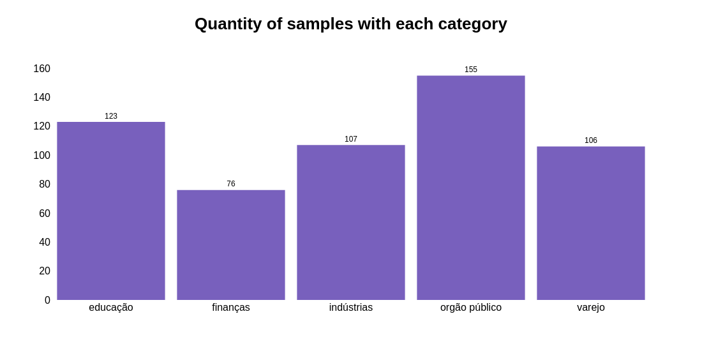
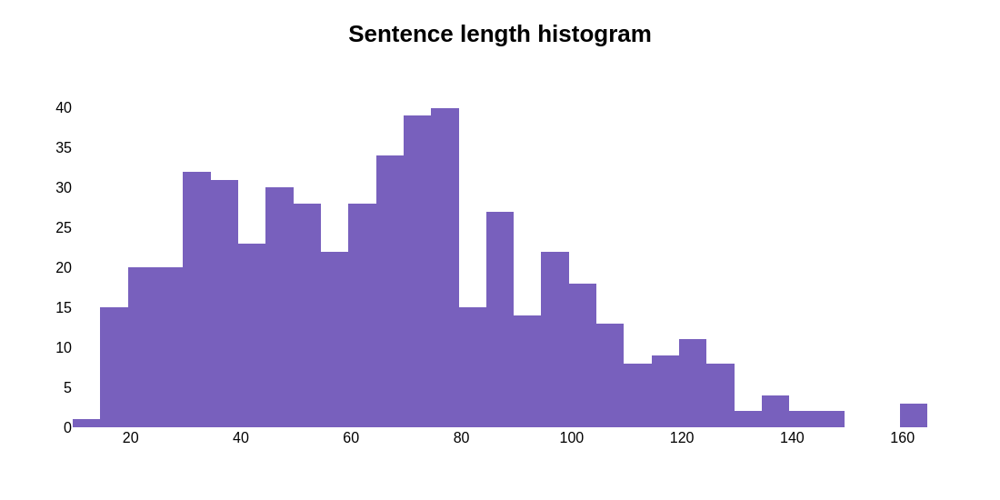

# Classificação de texto

Neste projeto, foram empregadas técnicas de Processamento de Linguagem Natural (PLN) e modelos clássicos de machine learning com o objetivo de classificar textos nas seguintes categorias: `['educação', 'finanças', 'indústrias', 'órgão público', 'varejo']`.

## Exploratory Data Analysis (EDA)

No notebook `eda.ipynb`, apresentamos gráficos e estatísticas descritivas dos dados utilizados para abordar este problema.

Em um dos gráficos, é exibida a quantidade de sentenças (amostras) para cada categoria. Nota-se que a categoria `órgão público` possui o maior número de amostras, seguida por educação, indústria, varejo e finanças.



Podemos verificar também a distribuição do tamanho das sentenças. Nesse gráfico podemos notar que a maioria das sentenças tem até 80 characters.



## Pré-processamento

> As etapas de pré-processamento, treinamento e validação do modelo mostradas a seguir se encontram nos arquivos `training.py` e `text_classification_model.ipynb`

Este problema é caracterizado como multi-label, significando que uma mesma amostra pode ser classificada em mais de uma categoria simultaneamente. Por exemplo, uma sentença poderia ser categorizada tanto em varejo quanto em finanças. Dada essa natureza, abordagens específicas são necessárias.

Este problema é caracterizado como multi-label, significando que uma mesma amostra pode ser classificada em mais de uma categoria simultaneamente. Por exemplo, uma sentença poderia ser categorizada tanto em `varejo` quanto em `finanças`. Dada essa natureza, abordagens específicas são necessárias.

Antes do processamento das sentenças, o conjunto de dados foi dividido em 80% para treinamento e 20% para validação. Essa divisão é crucial para ajustar as técnicas de processamento apenas nos dados de treinamento e, posteriormente, aplicá-las aos dados de validação, evitando o vazamento de dados.

Em relação ao processamento de cada sentença foi utilizada a função
```python
def process_string(string):
    string = string.strip().lower()
    string = re.sub(r'[^\w\s]', '', string)
    string = " ".join([token.lemma_ for token in nlp(string)])
    string = re.sub(' +', ' ', string)
    return string
```
Essa função remove espaços em branco no início e no fim da string e coloca ela em letra minúscula. Usa regex para remover pontuação e espaços em branco duplicados. Além disso, utiliza uma técnica chamada lematização. Essa técnica reduz uma palavra à sua forma base ou "lema". Ela considera a análise morfológica completa das palavras, garantindo que a forma reduzida seja uma palavra válida no dicionário da língua em questão. Por exemplo, o verbo *esperar* pode ser encontrado também dependendo do contexto como *esperou*, *espera*, *esperando*, todas essas palavras ao serem lematizadas se tornariam apenas *esperar*. Isso ajuda a simplificar o conjunto de dados o que facilita o treinamento dos modelos.

Conforme falado anteriormente não se pode utilizar as strings como *input* do modelos. Existem algumas técnicas que podem ser utilizadas com o objetivo de realizar essa conversão de string para número. Uma das técnicas mais famosas é **TF-IDF (Term Frequency-Inverse Document Frequency)**. Nessa técnica a **Frequência do Termo (TF)** indica a frequência na qual uma palavra aparece no documento, se ele aparecer muitas vezes pode ser um indicativo de que seja uma palavra importante. Por sua vez, a **Frequência Inversa de Documento (IDF)** indica a importância de uma palavra considerando o quão rara ou comum ela é no documento, assim palavras que aparecem poucas vezes possuem um peso maior do que palavras que aparecem com muita frequência. Por fim o **TF-IDF** acaba sendo uma combinação desses dois últimos, é um número que cada palavra do dataset recebe que indica a importância dela para todo documento. Isso contribui muito para encontrar as informações mais importantes para o treinamento do modelo.

Como é possível imaginar existem palavras que aparecem em uma grande quantidade nos textos, por exemplo *e, o, a, os, as um, uma, uns, umas*. Essas palavras são chamadas de *stop words* e para não prejudicarem o processamento das sentenças elas foram removidas.

## Treinamento

Como esse problema é multi-label, ele teve que ser tratado de forma distinta. Para isso foi utilizada a classe `MultiOutputClassifier` do `sklearn`, basicamente o que ela faz é ajustar um classificador por *target*. Esta é uma estratégia simples para estender classificadores que não suportam nativamente a classificação multi-label. Essa classe serve como um *wrapper* que encapsula a classe do classificador permitindo que ele seja utilizado em datasets multi-label. Foram testados alguns modelos, mas o que parece ter performado melhor foi a árvore de decisão `DecisionTreeClassifier`, por esse motivo ela foi utilizada.

Para treinar esse modelo utilizou-se a validação cruzada (Kfold). O `KFold` é uma técnica usada para avaliar a performance de modelos de machine learning de uma maneira mais robusta e confiável. Nela, o conjunto de dados de treinamento é dividido "K" partes ou grupos (nesse projeto foram utilizados 5 *folds*). Em cada rodada *K-1* grupos são usado para treinar o modelo e uma parte é usada para testá-lo. O processo é repetido até que todas as partes tenham sido usadas para treinar e testar o modelo. No final se tem *K* medidas de performance do modelo podendo-se calcular a média geral para ter uma ideia de como o modelo performou.

O propósito do `KFold` é, então, fornecer uma maneira sistemática de testar seu modelo em diferentes partes dos seus dados para garantir que a performance não depende de uma divisão específica de treinamento e teste. Isso ajuda a identificar se o modelo é realmente bom ou se apenas "decorou" os dados de treinamento.

## Validação

Aquele conjunto que foi separado no início do projeto foi então usado para validar o modelo e ver sua performance com dados não vistos. Nesse caso foram observadas duas métricas a acurácia e a *hamming loss*. A primeira mede o quão bem o modelo está performando, quanto maior o seu valor melhor é o modelo. Pode-se observar que nesse projeto a acurácia foi baixa (por volta de 40%), isso se deve ao fato de como ela é calculada em projetos multi-label. Nesse caso, por exemplo, se eu tiver uma sentença classificada como `['finanças', 'indústrias']` e ao usar o meu modelo ele prediz como sendo somente `['finanças']` isso seria considerado erro culminando em uma acurácia nula. Nesse caso existem outras métricas melhores de serem usadas.

Uma métrica muito utilizada em problemas multi-label é a *Hamming Loss*. Essa é uma forma de calcular a porcentagem de erros nas previsões de um modelo, ela é útil para entender quão precisas são as previsões em tarefas onde cada item pode ser classificado em várias categorias simultaneamente. No exemplo anterior, o modelo teria acertado uma classe de duas possíveis e portanto a hamming loss seria 50%. Assim, quanto menor o seu valor, melhor é o modelo em acertar todas as classes corretas para cada item.

## Deploy

Para realizar predições de novas sentenças foi criada uma API em Flask. Para isso, basta executar o arquivo `main.py` e fazer uma requisição no endpoint classify com a sentença que queira classificar. Por exemplo:
```bash
curl -X POST http://127.0.0.1:5000/classify -d "Melhor política industrial é acabar com isenção para compras internacionais, diz presidente da Fiemg" -H "Content-Type: text/plain"
```
A Api ira retornar a seguinte sentença:
```bash
Segundo nosso modelo o texto digitado possui maior probabilidade de ser da(s) categoria(s): ['varejo']%
```

## Melhorias observações

Ao longo do desenvolvimento deste projeto, foi evidenciado que o modelo apresenta um desempenho satisfatório ao lidar com dados não familiares. Contudo, observou-se que sentenças mais breves, apesar de claramente pertencerem a uma das categorias estabelecidas, frequentemente não eram classificadas em nenhuma classe específica. Isso sugere que o modelo tende a performar melhor com textos de maior extensão. Tal limitação poderia potencialmente ser mitigada através da expansão do conjunto de dados utilizado no treinamento ou pela exploração de diferentes abordagens de pré-processamento.

Adicionalmente, é importante considerar que, nos tempos atuais, há disponibilidade de modelos de *deep learning* avançados, pré-treinados especificamente para resolver desafios complexos de processamento de linguagem natural. A depender do escopo e dos objetivos específicos da aplicação, a adoção dessas tecnologias avançadas pode ser necessária. No entanto, para este projeto em particular, constatou-se que as técnicas clássicas de *machine learning* se mostraram suficientemente eficazes, indicando que, em determinados contextos, abordagens mais tradicionais ainda podem oferecer resultados robustos e satisfatórios.

## Referências

- [Classificação de frases por setor](https://handtalk.notion.site/Classifica-o-de-frases-por-setor-18c80adbbf874c519c9efe19678ac4c1)
- [Must Known Techniques for text preprocessing in NLP](https://www.analyticsvidhya.com/blog/2021/06/must-known-techniques-for-text-preprocessing-in-nlp/)
- [Quick Introduction to Bag-of-Words (BoW) and TF-IDF for Creating Features from Text](https://www.analyticsvidhya.com/blog/2020/02/quick-introduction-bag-of-words-bow-tf-idf/)
- [Multilabel Classification: An Introduction with Python’s Scikit-Learn](https://www.kdnuggets.com/2023/08/multilabel-classification-introduction-python-scikitlearn.html)
